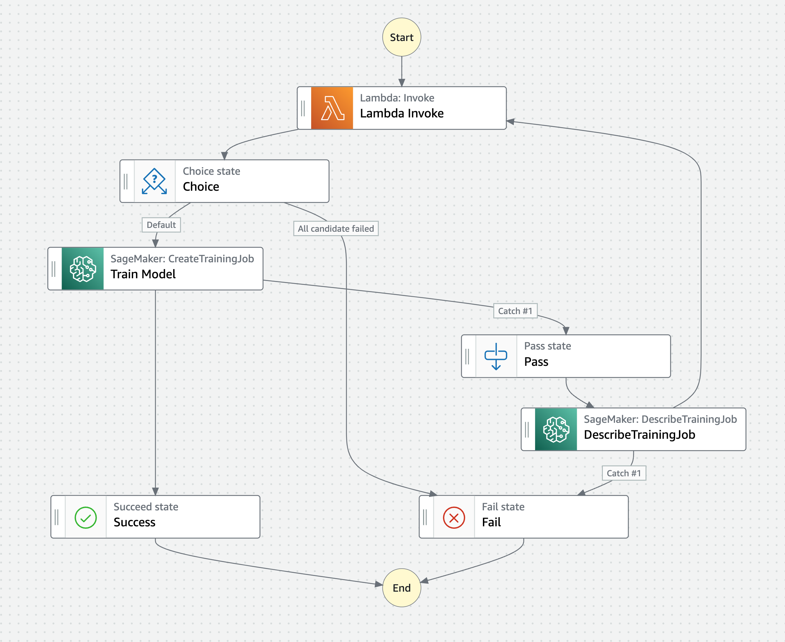

# Amazon SageMaker Managed Spot Training ワークフロー

このサンプルは、Amazon SageMaker Managed Spot Training の機能を拡張するワークフローを作成するためのものです。使用する主な AWS サービスは以下の通りです。

- Amazon SageMaker
- AWS Step Functions
- Amazon S3
- AWS Lambda

詳細は、sagemaker-managed-spot-training-pipeline.ipynb をご参照ください。
